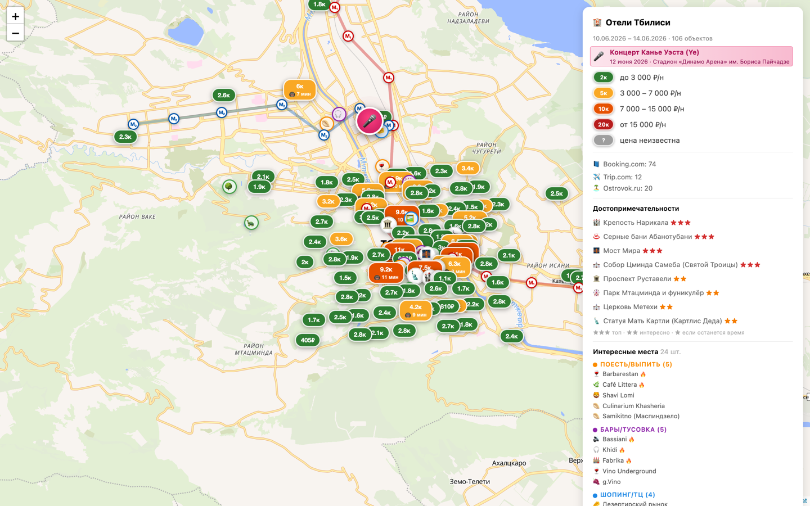

# hotel-parser

Парсер отелей с Booking/Trip/Ostrovok + интерактивная карта города на Leaflet и Excel-отчёт.

В отличие от Яндекс.Карт, где видно «всё вообще», здесь — кураторский набор данных под конкретную поездку: цены отелей рядом с достопримечательностями, метро, и современные места 2025-2026 (рестораны/бары/ТЦ/природа/загородные точки в часе-двух езды).



> На скриншоте — текущая конфигурация (Тбилиси, 10–14 июня): ценовые пины отелей, 2 линии метро, достопримечательности и интересные места в кликабельной легенде, русские подписи карты и особая пульсирующая метка концерта Канье Уэста на «Динамо Арене».

## Что внутри

**Парсинг отелей** — Playwright-скрипт собирает с трёх источников цены, рейтинги, расстояния до метро и центра, адреса, ссылки. Между запусками — append-only JSONL-чекпоинт, краш не теряет собранное. Booking ограничен типом «Отели» (без апартаментов), цена берётся как **итог за весь период** проживания.

**Excel-отчёт** (5 листов): Топ-рекомендации, Итог по ценовым категориям, Все отели с фильтрами, Сортировка по рейтингу, Сравнение источников.

**HTML-карта**:
- **Русские подписи** на карте любого города — векторная подложка [OpenFreeMap](https://openfreemap.org) через MapLibre GL, без API-ключа (CARTO Voyager как растровый фолбэк)
- Отели с цветными ценовыми пинами (зелёный — до 3 000 ₽/ночь, жёлтый — до 7 000, оранжевый — до 15 000, красный — премиум); хостелы/гестхаусы/апартаменты на карте скрыты
- Линии метро с polyline-связками между станциями
- Достопримечательности с фото-галереей (← →), описаниями, приоритетами ★/★★/★★★
- 20–25 «интересных мест» в 5 категориях (еда / тусовка / шопинг / природа / загород) с фото и тренд-бейджами 🔥 для топов 2025-2026
- **Особые метки-события** (концерты, матчи): крупная пульсирующая метка поверх всего + строка в легенде
- Кликабельная легенда справа: тык по пункту → карта летит к маркеру и открывает попап
- Toggle-слои: метро вкл/выкл, интересные места вкл/выкл

**Валидация координат и цен** — Nominatim для адресов часто врёт (особенно номера домов), поэтому: ручные overrides для известных отелей по substring-match имени + проверка через расстояние до заявленной станции метро. Код страны для геокодера задаётся в конфиге (`geocode_countrycodes`). Цены проходят санити-проверку диапазона (отсев склеек чисел).

## Установка

```bash
npm install
npx playwright install chromium
```

## Быстрый старт (Тбилиси, как сейчас сконфигурирован)

```bash
npm run parse           # 5-15 мин, не headless — могут быть капчи
npm run report          # < 30 сек
open output/hotels_tbilisi_*_map.html
```

Либо по одному источнику:
```bash
npm run parse:booking
npm run parse:trip
npm run parse:ostrovok
```

> Парсер не-headless: при первом открытии Booking/Trip/Ostrovok может появиться капча — на неё заложено ~60 секунд, после чего скрипт продолжает сам.

## Адаптация под свой город

Эту карту легко переделать под любой город — алгоритм описан в [CLAUDE.md](CLAUDE.md) (это инструкции для AI-ассистента, но и человек по ним сделает). Краткая выжимка:

### 1. Поправить шапку `hotel-config.json`

```json
{
  "город": {
    "название": "Тбилиси",
    "страна":   "Грузия",
    "query_booking": "Тбилиси, Грузия",
    "query_trip":    "Tbilisi",
    "cityid_trip":   7612,
    "lat": 41.6935, "lng": 44.8015,
    "slug": "tbilisi",
    "slug_ostrovok": "tbilisi",
    "country_ostrovok": "georgia",
    "geocode_countrycodes": "ge"
  },
  "даты":  { "заезд": "2026-06-10", "выезд": "2026-06-14" },
  "гости": { "взрослых": 2, "номеров": 1 }
}
```

- `cityid_trip` — числовой ID города на Trip.com (из URL `trip.com/hotels/<slug>-hotels-list-<ID>/`); при `null` подставится строка из `query_trip`.
- `slug_ostrovok` / `country_ostrovok` — из URL Ostrovok `ostrovok.ru/hotel/<country>/<slug>/`.
- `geocode_countrycodes` — ISO-код страны для фильтра Nominatim (`ge`, `by`, …).

### 2. Собрать контент карты

Это ~30-60 минут с research-агентами. Что нужно:

| Раздел | Что собрать | Источник |
|---|---|---|
| **Метро** | все станции, координаты, номер линии, флаг пересадки | Wikipedia «Список станций X метрополитена» + OSM |
| **Ручные координаты отелей** | топ-15 сетевых (Hilton, Marriott, Radisson, Ibis…) с координатами | OSM Nominatim/Overpass напрямую по имени |
| **Достопримечательности** | 5-10 классических с описаниями, приоритетами, 1-3 фото | Wikipedia REST API: `/api/rest_v1/page/summary/<title>` |
| **Интересные места** | 15-25 современных в 5 категориях | локальные тревел-блоги, WHERETOEAT, Tripadvisor топы |
| **Загородные точки** | 2-3 в радиусе 2ч езды (замки, природа, этно-музеи) | то же |
| **Особые события** (опц.) | концерт/матч на даты поездки | афиши, билетные сайты |

Структура каждого раздела — см. примеры в текущем `hotel-config.json`.

### 3. Запустить парсер и отчёт

Команды те же что в быстром старте.

## Структура config (`hotel-config.json`)

```json
{
  "город":   { ... },
  "даты":    { "заезд": "...", "выезд": "..." },
  "гости":   { "взрослых": 2, "номеров": 1 },

  "ручные_координаты": {
    "<lowercase substring имени отеля>": { "lat": ..., "lng": ... }
  },

  "метро": [
    { "название": "...", "lat": ..., "lng": ...,
      "линия": 1, "пересадка": true }
  ],

  "достопримечательности": [
    { "название": "...", "описание": "...",
      "lat": ..., "lng": ..., "тип": "🏛",
      "приоритет": 3, "фото": ["url1", "url2"] }
  ],

  "интересные_места": [
    { "название": "...", "категория": "еда",
      "описание": "...", "адрес": "...",
      "lat": ..., "lng": ..., "тип": "🍽",
      "тренд": true, "фото": ["..."] }
  ],

  "события": [
    { "название": "Концерт …", "дата": "12 июня 2026",
      "место": "Стадион …", "описание": "...",
      "lat": ..., "lng": ..., "тип": "🎤", "фото": ["..."] }
  ]
}
```

Категории интересных мест строго одни из: `еда`, `тусовка`, `шопинг`, `природа`, `загород`.
Блок `события` опционален — каждый элемент рисуется крупной пульсирующей меткой поверх карты.

## Структура проекта

```
hotel-parser/
├── hotel-parser.js     # Playwright-парсер 3 источников
├── build-report.js     # генерация Excel + HTML-карты
├── hotel-config.json   # параметры поиска и контент карты
├── CLAUDE.md           # инструкция для AI-ассистентов: как сделать карту для нового города
├── README.md
├── docs/preview.png    # скриншот карты для README
├── output/             # результаты (в .gitignore)
│   ├── latest.json     # последний массив всех отелей
│   ├── geocode-cache.json  # кэш Nominatim
│   ├── run_<ts>/       # чекпоинты по запускам (JSONL append-log)
│   ├── hotels_*.xlsx
│   └── hotels_*_map.html
└── package.json
```

## Что не реализовано (см. TODO.md)

- Пагинация (сейчас ~75 отелей с Booking, ~12-20 с Trip/Ostrovok)
- CLI-аргументы (`--city`, `--checkin`, `--checkout`)
- Дедупликация отелей между источниками
- Настраиваемое время ожидания капчи (сейчас 60 с захардкожено)

## Лицензия

MIT.
